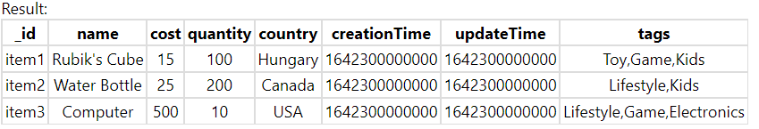
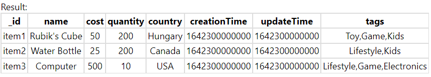
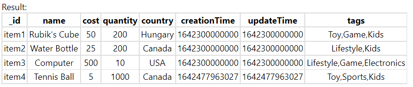
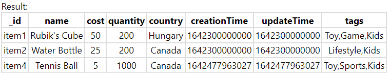
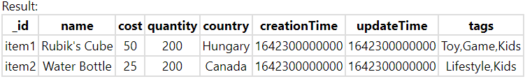
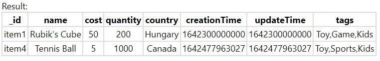

# InventoryTracker
This repository is my submission for the 2022 Shopify Backend Developer Intern  Challenge. The purpose of this web application is to track inventory for a logistics company. 
My application supports the basic features of 
- Viewing all inventory items
- Updating inventory items
- Creating inventory items
- Deleting inventory Items

For my additional feature, I chose to support filtering based on fields/inventory count/tags etc.

# Tech Stack
- ExpressJS used for routing the application and creating endpoints
- MongoDB used for storing the data for inventory items
- HTML/CSS for the design of the front-end

# Requirements
- Clone the repository
- Install MongoDB from [here](https://www.mongodb.com/try/download/community)
- After installing MongoDB, ```cd``` into the routing directory and load the initial data by typing ```mongo``` in your shell and typing ```load("initdb.mongo")```
- After loading the data, we need to install express and MongoDB by typing ```npm install express``` followed by ```npm install mongodb```
- Start the server by typing ```node server.js``` and navigate to localhost:3000 and you are ready!

# Routes
| HTTP Method   | Endpoint           | Notes  |
| ------------- |:-------------:| -----:|
| GET      | /inventory | This endpoint retrieves all inventory items.|
| PUT      | /inventory/:id | This endpoint updates an inventory item.| 
| POST      | /inventory | This endpoint creates an inventory item.| 
| DELETE      | /inventory/:id | This endpoint deletes an inventory item.| 
| GET      | /inventory/filter | This endpoint retrieves all inventory items based on a filter. A filter is comprised of an attribute, comparator and a value.|


# Examples
## Viewing all items in inventory
```
curl --location --request GET 'localhost:3000/inventory/' \
--header 'Content-Type: application/json' \
--data-raw '    {
        "attribute": "tags",
        "comparator": "=",
        "value": ["Lifestyle"]
    }'
```


## Updating an inventory item

Changing cost of item1 to 50 and quantity to 200
```
curl --location --request PUT 'localhost:3000/inventory/item1' \
--header 'Content-Type: application/json' \
--data-raw '{
        "name": "Rubik'\''s Cube",
        "cost": 50,
        "quantity": 200,
        "country": "Hungary",
        "creationTime": 1642300000000,
        "updateTime": 1642300000000,
        "tags": [
            "Toy",
            "Game",
            "Kids"
        ]
    }'
```


## Creating an inventory item

Creating a tennis ball item
```
curl --location --request POST 'localhost:3000/inventory' \
--header 'Content-Type: application/json' \
--data-raw '{
        "id": "item4",
        "name": "Tennis Ball",
        "cost": 5,
        "quantity": 1000,
        "country": "Canada",
        "tags": [
            "Toy",
            "Sports",
            "Kids"
        ]
    }'
```


## Deleting an inventory item

Deleting item 3
```
curl --location --request DELETE 'localhost:3000/inventory/item3'
```


## Filtering an inventory item (Example 1)

Retrieve all items that cost more than 20
```
curl --location --request GET 'localhost:3000/inventory/filter?attribute=cost&comparator=>&value=20'
```


## Filtering an inventory item (Example 2)

Retrieve all items that have tags as Toys and Kids
```
curl --location --request GET 'localhost:3000/inventory/filter?attribute=tags&comparator==&value=Toy,Kids'
```
